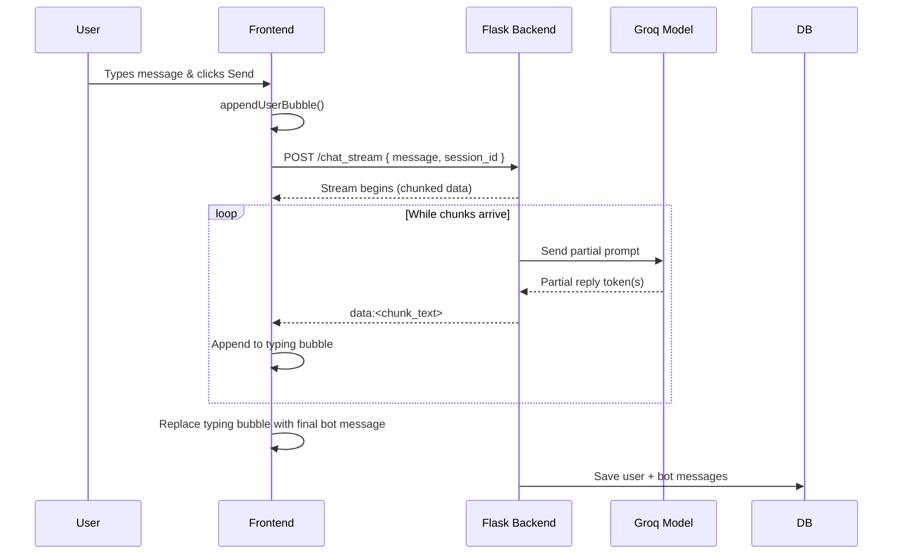
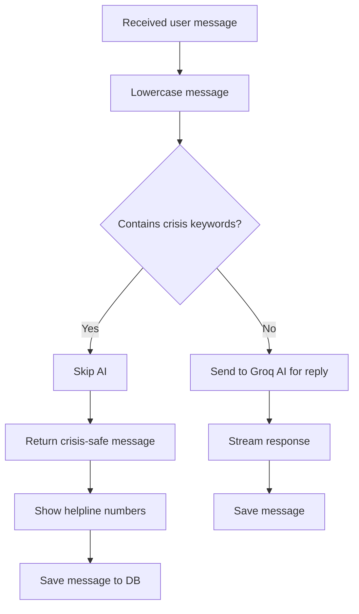
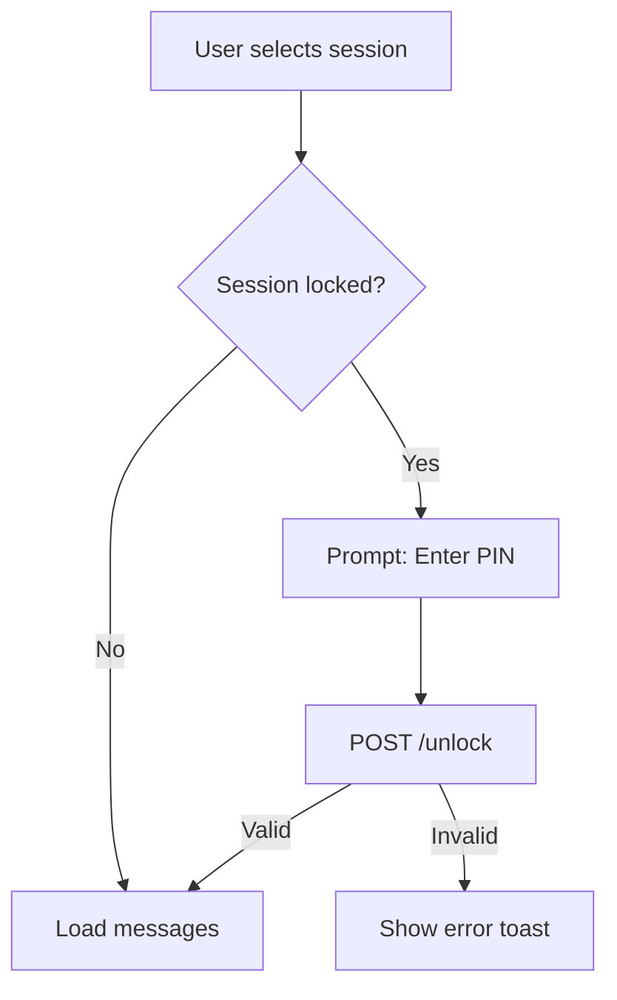
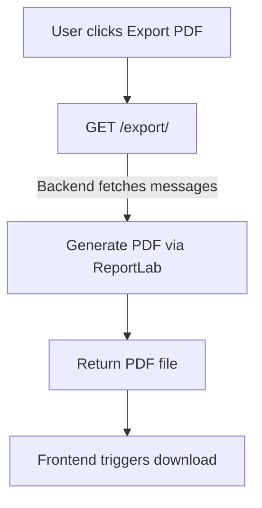

# 📄 **`FLOWCHARTS.md` – RelaxBuddy System Flowcharts (v1)**

````markdown
# 🌊 RelaxBuddy Flowcharts (v1)
This document contains all major system flowcharts for the RelaxBuddy Emotional Support Chatbot.

Diagrams are written in **Mermaid** and render automatically inside GitHub.

---

# 1️⃣ User Authentication Flow
```mermaid
flowchart TD

A[Open App] --> B{Token exists in localStorage?}

B -->|Yes| C[Validate token /sessions]
C -->|Valid| D[Load dashboard]
C -->|Invalid| E[Show login modal]

B -->|No| E[Show login modal]

E --> F[User enters username & password]
F --> G[POST /login]
G -->|Success| H[Save token in localStorage]
H --> D[Load dashboard]
G -->|Fail| I[Show error toast]
````

---

# 2️⃣ Session Creation & Management Flow

```mermaid
flowchart TD

A[Dashboard Loaded] --> B[User clicks New Session]
B --> C[Prompt for name]
C -->|Provided| D[POST /new_session]
D -->|Success| E[Add to session list UI]
E --> F[Open session]
D -->|Error| G[Show toast]

F --> H[User views all messages]
H --> I[User can delete / lock / rename]
```

---

# 3️⃣ Chat Messaging + Streaming Flow



---

# 4️⃣ Crisis Detection Flow



---

# 5️⃣ Session Lock / Unlock Flow (PIN)



---

# 6️⃣ Export to PDF Flow



---

# 7️⃣ Full System Architecture Overview

```mermaid
flowchart LR

subgraph FE[Frontend - HTML/CSS/JS]
    A1[UI Components<br>Auth Modal<br>Session List<br>Chat UI] 
    A2[LocalStorage<br>(token, theme, profile)]
    A3[Streaming Handler<br>(Reader API)]
end

subgraph BE[Flask Backend]
    B1[Auth Controller]
    B2[Session Controller]
    B3[Chat Controller]
    B4[Crisis Detector]
    B5[PDF Exporter]
    B6[SQLite ORM Layer]
end

subgraph AI[Groq API]
    C1[groq/compound Model]
end

A1 --> B1
A1 --> B2
A1 --> B3
B3 --> B4
B3 --> C1
C1 --> B3
B3 --> B6
B2 --> B6

A2 -.-> A1
```

---

# ✔ End of Flowcharts

These diagrams cover everything:

* Auth workflow
* Chat streaming logic
* Session system
* AI processing
* Crisis handling
* Data storage
* Architectural overview

---
